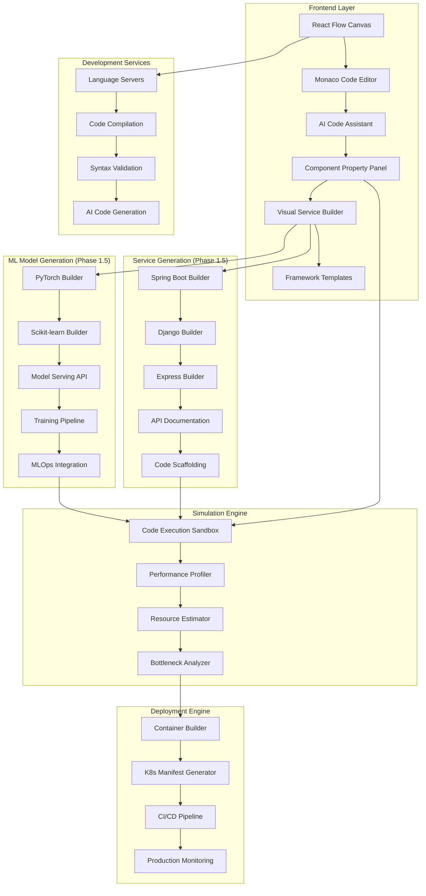

# ScaleSim Phase Two Roadmap 🚀
**Visual Development Environment for Distributed Systems & ML Infrastructure**

> *Transforming ScaleSim from simulation platform to full-featured development environment*

---

## 🎯 Phase Two Vision: The "Visual Studio for Distributed Systems"

**Core Transformation:**
- From: Visual simulation tool → To: **Complete visual development environment**
- Enable users to **write actual code** that runs on components
- **AI-assisted development** for distributed systems and ML workflows
- **Real-time code simulation** with performance feedback
- **One-click deployment** of user-written code to production

---

## 🔥 Revolutionary Features

### **1. Visual Code Development**
```
Drag Component → Configure Properties → Write Code → Simulate → Deploy
     ↓                ↓                ↓           ↓          ↓
   Kafka          Set Topics       Consumer     Performance   Production
 Component       Partitions=8    .java/.py     Analysis     Deployment
```

**Code Integration Points:**
- **Stream Processing**: Write Flink/Kafka Streams/Spark code
- **ML Training**: Custom PyTorch/TensorFlow training scripts
- **Model Serving**: Custom inference endpoints and preprocessing
- **Microservices**: API handlers, business logic, data validation
- **Data Pipeline**: ETL transformations, data quality checks
- **Message Handlers**: Queue processors, event handlers

### **2. AI-Assisted Code Development**

**Smart Code Generation:**
- **Context-Aware**: AI understands component topology and data flow
- **Performance-Optimized**: Generates code with best practices built-in
- **Template Library**: Pre-built patterns for common use cases
- **Code Review**: AI suggests optimizations and catches issues

**Example Workflow:**
```
User: "Create a Kafka consumer that processes user events and updates Redis cache"
AI: Generates optimized consumer code with error handling, metrics, and backpressure
User: Modifies business logic as needed
System: Simulates performance with actual code metrics
```

### **3. Multi-Language Support**

**Supported Languages by Component Type:**
- **Stream Processing**: Java, Scala, Python, Go
- **ML Training**: Python, R, Julia
- **Model Serving**: Python, Go, Rust, C++
- **Microservices**: Java, Python, Go, Node.js, Rust
- **Data Processing**: SQL, Python, Scala, R

**Code Editor Features:**
- **Monaco Editor** (VS Code engine) integration
- **Language servers** for IntelliSense and error detection
- **Real-time syntax highlighting** and code completion
- **Integrated debugging** with breakpoints and variable inspection

---

## 🏗️ Technical Architecture

### **Visual Development Environment Stack**



### **Code Development Workflow**

**1. Component Selection & Configuration**
- Drag component (e.g., Flink, Kafka, ML Model)
- Configure basic properties (topics, resources, etc.)
- System generates **code template** based on component type

**2. Code Development**
- **AI-suggested starter code** based on component connections
- **Rich IDE experience** with autocomplete and error detection
- **Live documentation** showing API methods and examples
- **Code snippets library** for common patterns

**3. Real-Time Simulation**
- **Hot reload** - changes reflect immediately in simulation
- **Performance profiling** of user code during simulation
- **Resource usage prediction** based on actual code complexity
- **Bottleneck identification** in user logic

**4. Testing & Validation**
- **Unit test generation** by AI
- **Integration testing** across component boundaries
- **Load testing** with realistic traffic patterns
- **Error injection** to test resilience

---

## 💡 Implementation Phases

### **Phase 1.5: Visual Service & ML Model Builder (Pre-Phase 2)**

#### **🔧 Framework-Specific Service Builders**
- [ ] **Web Framework Components**: Rails, Django, Express, Laravel, Spring Boot
- [ ] **API Framework Components**: FastAPI, Flask, ASP.NET Core, Gin (Go)
- [ ] **RPC Framework Components**: gRPC, Apache Thrift, Protocol Buffers
- [ ] **Event-Driven Components**: Event handlers, webhooks, message processors

**Visual Endpoint Designer**
- [ ] Drag-and-drop endpoint creation (GET, POST, PUT, DELETE)
- [ ] Request/response schema definition with JSON Schema
- [ ] Authentication and authorization configuration
- [ ] Rate limiting and throttling settings
- [ ] Input validation and error handling setup

#### **🤖 Visual ML Model & Pipeline Builder**
**Model Architecture Builders**
- [ ] **Neural Network Designer**: PyTorch, TensorFlow, Keras visual model builder
- [ ] **Classical ML Models**: Scikit-learn, XGBoost, LightGBM configuration
- [ ] **Deep Learning Architectures**: CNN, RNN, Transformer templates
- [ ] **Custom Layer Builder**: Visual layer composition and parameter tuning

**Training Pipeline Designer**
- [ ] **Data Loading Pipeline**: Visual ETL for training data (CSV, Parquet, JSON)
- [ ] **Preprocessing Workflows**: Feature engineering, normalization, augmentation
- [ ] **Training Configuration**: Hyperparameters, optimizers, loss functions
- [ ] **Evaluation Metrics**: Accuracy, precision, recall, custom metrics setup

**Model Serving Builders**
- [ ] **Inference API Generator**: FastAPI, Flask endpoints for model serving
- [ ] **Batch Prediction Pipelines**: Spark, Ray batch processing workflows  
- [ ] **Real-time Serving**: TorchServe, TensorFlow Serving, ONNX Runtime
- [ ] **Model Monitoring**: Performance tracking, drift detection, A/B testing

**MLOps Integration**
- [ ] **Experiment Tracking**: MLflow, Weights & Biases integration
- [ ] **Model Registry**: Versioning, staging, production deployment
- [ ] **Feature Store**: Online/offline feature serving configuration
- [ ] **Data Validation**: Great Expectations, evidently.ai integration

#### **🔗 Universal Component Integration**
- [ ] Export user-built services as reusable components
- [ ] Export user-built ML models as inference components
- [ ] Integration with system simulation engine
- [ ] Performance estimation for custom endpoints and model inference
- [ ] Load testing capabilities for services and ML endpoints

**Framework Templates & Scaffolding**
- [ ] Auto-generate boilerplate code for each framework
- [ ] Database integration templates (PostgreSQL, MongoDB, Redis)
- [ ] ML infrastructure templates (Ray, Kubeflow, SageMaker)
- [ ] Middleware and plugin configuration
- [ ] Deployment configuration (Docker, K8s manifests)

### **Phase 2.1: Foundation (Months 1-3)**
**Code Editor Integration**
- [ ] Integrate Monaco Editor with React Flow
- [ ] Multi-language syntax highlighting
- [ ] Basic code templates for each component type
- [ ] Simple code compilation and validation

**Component Code Framework**
- [ ] Define code interfaces for each component type
- [ ] Create starter templates (Kafka Consumer, Flink Job, ML Training, etc.)
- [ ] Build code-to-component property mapping
- [ ] Implement basic code execution sandbox

### **Phase 2.2: AI-Assisted Development (Months 4-6)**
**AI Code Generation**
- [ ] Integration with OpenAI/Claude for code generation
- [ ] Context-aware prompts based on component topology
- [ ] Code optimization suggestions
- [ ] Error fixing recommendations

**Smart Development Features**
- [ ] Auto-completion based on component APIs
- [ ] Dependency injection for connected components
- [ ] Performance hints and warnings
- [ ] Best practices enforcement

### **Phase 2.3: Advanced Simulation (Months 7-9)**
**Code Performance Simulation**
- [ ] Static code analysis for performance estimation
- [ ] Memory usage prediction
- [ ] CPU utilization modeling
- [ ] Network I/O estimation based on code patterns

**Real-Time Code Execution**
- [ ] Sandboxed code execution during simulation
- [ ] Live metrics and profiling
- [ ] Performance comparison (user code vs. optimized)
- [ ] Resource scaling recommendations

### **Phase 2.4: Production Deployment (Months 10-12)**
**Code-to-Production Pipeline**
- [ ] Automatic containerization of user code
- [ ] Kubernetes manifest generation
- [ ] CI/CD pipeline creation
- [ ] Production monitoring setup

**Advanced Features**
- [ ] A/B testing framework for code changes
- [ ] Canary deployment automation
- [ ] Performance monitoring and alerting
- [ ] Rollback capabilities

---

## 🎨 Phase 1.5: Visual Microservice Builder

### **Revolutionary Service Development**

**The Problem**: Developers spend hours setting up boilerplate code, configuring frameworks, and writing repetitive CRUD operations before they can focus on business logic.

**The Solution**: Visual microservice builders that let users design APIs graphically, then generate production-ready code.

### **Visual Service & ML Design Workflows**

#### **🔧 Microservice Development Workflow**
```
1. Choose Framework → 2. Design Endpoints → 3. Configure Data → 4. Generate Code → 5. Simulate & Test
        ↓                    ↓                  ↓                ↓                  ↓
   [Spring Boot]        [GET /users]      [PostgreSQL]     [Java Code]      [Performance Analysis]
   [Django]             [POST /users]     [Schema]         [Python Code]    [Load Testing]
   [Express]            [PUT /users/:id]  [Validation]     [Node.js Code]   [Integration Testing]
```

#### **🤖 ML Model Development Workflow**
```
1. Choose ML Type → 2. Design Architecture → 3. Configure Training → 4. Generate Code → 5. Train & Serve
        ↓                    ↓                    ↓                  ↓                ↓
   [Classification]     [Neural Network]     [Hyperparams]    [PyTorch Code]   [Model Serving API]
   [Regression]         [3-Layer MLP]        [Adam, LR=0.01]  [Training Loop]  [Performance Metrics]
   [NLP]               [Transformer]        [Data Pipeline]   [Evaluation]     [A/B Testing]
```

### **Framework-Specific Visual Builders**

#### **1. Spring Boot Microservice Builder**
**Visual Components:**
- **Controller Designer**: Drag endpoints, configure request mapping
- **Entity Designer**: Visual JPA entity relationships
- **Security Config**: OAuth2, JWT, role-based access control
- **Database Integration**: Auto-configure Spring Data repositories

**Generated Artifacts:**
```java
@RestController
@RequestMapping("/api/users")
public class UserController {
    
    @Autowired
    private UserService userService;
    
    @GetMapping
    public ResponseEntity<List<User>> getUsers(
        @RequestParam(defaultValue = "0") int page,
        @RequestParam(defaultValue = "10") int size
    ) {
        // Auto-generated with pagination, validation, and error handling
        return ResponseEntity.ok(userService.getUsers(page, size));
    }
}
```

#### **2. Django REST API Builder**
**Visual Components:**
- **View Designer**: Function-based and class-based views
- **Serializer Builder**: Automatic field validation and transformation
- **URL Router**: Visual URL pattern configuration
- **Database Models**: Django ORM relationship designer

**Generated Artifacts:**
```python
from rest_framework import generics, permissions
from rest_framework.response import Response

class UserListAPIView(generics.ListCreateAPIView):
    queryset = User.objects.all()
    serializer_class = UserSerializer
    permission_classes = [permissions.IsAuthenticated]
    
    def get_queryset(self):
        # Auto-generated filtering and pagination
        return User.objects.filter(is_active=True)
```

#### **3. Express.js API Builder**
**Visual Components:**
- **Route Designer**: Visual middleware chain configuration
- **Schema Validator**: JSON Schema-based request validation
- **Auth Middleware**: JWT, session, OAuth integration
- **Database ORM**: Prisma, Sequelize, Mongoose integration

**Generated Artifacts:**
```javascript
const express = require('express');
const { body, validationResult } = require('express-validator');

app.post('/api/users',
  // Auto-generated validation middleware
  body('email').isEmail(),
  body('password').isLength({ min: 8 }),
  async (req, res) => {
    const errors = validationResult(req);
    if (!errors.isEmpty()) {
      return res.status(400).json({ errors: errors.array() });
    }
    
    // Auto-generated business logic template
    const user = await User.create(req.body);
    res.status(201).json(user);
  }
);
```

### **ML Model Builder Examples**

#### **1. PyTorch Neural Network Builder**
**Visual Components:**
- **Architecture Designer**: Drag layers (Linear, Conv2D, LSTM, Attention)
- **Activation Functions**: ReLU, GELU, Sigmoid with visual flow
- **Loss Function Config**: CrossEntropy, MSE, Custom loss selection
- **Optimizer Setup**: Adam, SGD, AdamW with learning rate scheduling

**Generated Artifacts:**
```python
import torch
import torch.nn as nn
import pytorch_lightning as pl

class CustomModel(pl.LightningModule):
    def __init__(self, input_size=784, hidden_size=128, num_classes=10):
        super().__init__()
        # Auto-generated architecture based on visual design
        self.layers = nn.Sequential(
            nn.Linear(input_size, hidden_size),
            nn.ReLU(),
            nn.Dropout(0.2),
            nn.Linear(hidden_size, hidden_size),
            nn.ReLU(),
            nn.Linear(hidden_size, num_classes)
        )
        
    def forward(self, x):
        return self.layers(x)
    
    def training_step(self, batch, batch_idx):
        # Auto-generated training loop
        x, y = batch
        y_hat = self(x)
        loss = nn.functional.cross_entropy(y_hat, y)
        return loss
```

#### **2. Scikit-learn Pipeline Builder**
**Visual Components:**
- **Preprocessing Chain**: StandardScaler, PCA, Feature Selection
- **Model Selection**: RandomForest, SVM, Gradient Boosting
- **Cross-Validation**: K-fold, stratified, time series splits
- **Hyperparameter Tuning**: Grid search, random search, Bayesian optimization

**Generated Artifacts:**
```python
from sklearn.pipeline import Pipeline
from sklearn.preprocessing import StandardScaler
from sklearn.ensemble import RandomForestClassifier
from sklearn.model_selection import GridSearchCV

# Auto-generated pipeline based on visual configuration
pipeline = Pipeline([
    ('scaler', StandardScaler()),
    ('feature_selection', SelectKBest(k=10)),
    ('classifier', RandomForestClassifier(random_state=42))
])

# Auto-generated hyperparameter tuning
param_grid = {
    'classifier__n_estimators': [100, 200, 300],
    'classifier__max_depth': [10, 20, None],
    'feature_selection__k': [5, 10, 15]
}

grid_search = GridSearchCV(pipeline, param_grid, cv=5, scoring='accuracy')
```

#### **3. Model Serving API Builder**
**Visual Components:**
- **Input Schema**: Define request format (JSON, images, text)
- **Preprocessing Steps**: Tokenization, normalization, feature extraction
- **Model Loading**: Local file, S3, model registry integration
- **Response Format**: Predictions, probabilities, explanations

**Generated Artifacts:**
```python
from fastapi import FastAPI, HTTPException
from pydantic import BaseModel
import torch
from transformers import AutoTokenizer, AutoModel

app = FastAPI(title="ML Model API", version="1.0.0")

class PredictionRequest(BaseModel):
    text: str
    max_length: int = 512

class PredictionResponse(BaseModel):
    prediction: str
    confidence: float
    processing_time_ms: float

@app.post("/predict", response_model=PredictionResponse)
async def predict(request: PredictionRequest):
    # Auto-generated preprocessing and inference
    start_time = time.time()
    
    # Tokenize input
    inputs = tokenizer(request.text, max_length=request.max_length, 
                      truncation=True, return_tensors="pt")
    
    # Run inference
    with torch.no_grad():
        outputs = model(**inputs)
        prediction = torch.argmax(outputs.logits, dim=-1)
    
    processing_time = (time.time() - start_time) * 1000
    
    return PredictionResponse(
        prediction=id2label[prediction.item()],
        confidence=torch.softmax(outputs.logits, dim=-1).max().item(),
        processing_time_ms=processing_time
    )
```

### **Advanced Service Configuration**

#### **1. Visual API Documentation**
- **Auto-generated OpenAPI/Swagger specs**
- **Interactive API documentation**
- **Request/response examples**
- **Authentication flow documentation**

#### **2. Performance & Monitoring Setup**
- **Built-in metrics collection** (request count, latency, errors)
- **Health check endpoints** automatically configured
- **Distributed tracing** setup (Jaeger, Zipkin)
- **Logging configuration** with structured logging

#### **3. Testing & Quality Assurance**
- **Auto-generated unit tests** for each endpoint
- **Integration test templates**
- **Load testing scenarios**
- **API contract testing**

### **Integration with System Simulation**

#### **Custom Component Export**
```
User builds Django API → Exports as "User Service" component → 
Uses in larger system design → Connects to PostgreSQL, Redis, Kafka →
Simulates entire system performance
```

#### **Performance Estimation**
- **Endpoint-level performance prediction** based on code complexity
- **Database query optimization** recommendations  
- **Caching strategy** suggestions
- **Horizontal scaling** recommendations

#### **Real-World Integration**
- **Service mesh integration** (Istio, Linkerd)
- **API gateway configuration** (Kong, Ambassador)
- **Container orchestration** (Kubernetes deployments)
- **CI/CD pipeline** generation

### **Use Case Examples**

#### **Example 1: E-commerce Microservices**
**Visual Design:**
```
[User Service] ← auth → [Order Service] ← inventory → [Product Service]
     ↓                        ↓                           ↓
[PostgreSQL]            [MongoDB]               [Elasticsearch]
```

**Generated Services:**
- **User Service**: Spring Boot with JWT auth, user registration/login
- **Order Service**: Express.js with order processing, payment integration
- **Product Service**: Django with product catalog, search functionality

#### **Example 2: Real-time Chat Application**
**Visual Design:**
```
[WebSocket Gateway] ← events → [Message Service] ← store → [Redis]
        ↓                           ↓                        ↓
[React Frontend]           [PostgreSQL]              [Message Queue]
```

**Generated Services:**
- **WebSocket Gateway**: Node.js with Socket.io integration
- **Message Service**: FastAPI with async message processing
- **Notification Service**: Go service with push notification support

#### **Example 3: ML-Powered Recommendation System**
**Visual Design:**
```
[User Activity API] → [Feature Pipeline] → [ML Training] → [Model Registry]
         ↓                    ↓                 ↓              ↓
[Event Stream]        [Feature Store]    [Ray Cluster]   [Serving API]
         ↓                    ↓                 ↓              ↓
[Real-time Recs] ← [Model Serving] ← [A/B Testing] ← [Production Model]
```

**Generated ML Components:**
- **Feature Pipeline**: Spark job for feature engineering and transformation
- **ML Training**: PyTorch model with collaborative filtering + neural networks
- **Model Serving**: FastAPI endpoint with real-time inference and caching
- **A/B Testing**: Multi-armed bandit for model comparison and optimization

#### **Example 4: Computer Vision Pipeline**
**Visual Design:**
```
[Image Upload API] → [Preprocessing] → [CNN Model] → [Object Detection]
         ↓                ↓               ↓              ↓
[S3 Storage]      [Image Augmentation] [PyTorch] [Bounding Boxes]
         ↓                ↓               ↓              ↓
[Batch Processing] ← [Model Training] ← [Dataset] ← [Annotation API]
```

**Generated ML Components:**
- **Image Upload API**: FastAPI with image validation and S3 integration
- **CNN Model**: ResNet-50 with transfer learning for custom object detection
- **Training Pipeline**: PyTorch Lightning with automatic mixed precision
- **Inference API**: Optimized serving with ONNX Runtime and GPU acceleration

---

## 🎮 User Experience Examples

### **Example 1: Kafka Stream Processing**

**Visual Design:**
```
[Kafka Topic] → [Flink Processor] → [Elasticsearch]
```

**Generated Code Template:**
```java
@Component
public class UserEventProcessor extends RichMapFunction<UserEvent, ProcessedEvent> {
    
    @Override
    public ProcessedEvent map(UserEvent event) throws Exception {
        // AI-generated starter code based on connected components
        ProcessedEvent processed = new ProcessedEvent();
        processed.setUserId(event.getUserId());
        processed.setTimestamp(System.currentTimeMillis());
        
        // TODO: Add your business logic here
        
        return processed;
    }
}
```

**AI Assistant Suggestions:**
- "Add error handling for malformed events"
- "Consider using async processing for external API calls"
- "Add metrics collection for monitoring"

### **Example 2: ML Model Training**

**Visual Design:**
```
[S3 Dataset] → [Ray Training] → [Model Registry] → [Serving Endpoint]
```

**Generated Code Template:**
```python
import ray
from ray import train
import torch

@ray.remote
class ModelTrainer:
    def train_model(self, config):
        # AI-generated based on connected data source and target
        model = torch.nn.Sequential(
            torch.nn.Linear(config["input_size"], 128),
            torch.nn.ReLU(),
            torch.nn.Linear(128, config["output_size"])
        )
        
        # TODO: Implement your training logic
        
        return model

# Performance prediction: 2.5 hours on 4 V100 GPUs
# Estimated cost: $45 on AWS
```

---

## 🚀 Competitive Advantages

### **1. Visual Programming Revolution**
- **First platform** to combine visual system design with actual code development
- **No context switching** between design tools and IDEs
- **Real-time performance feedback** during development
- **Visual microservice builders** - faster than traditional scaffolding tools

### **2. Complete Development Lifecycle**
- **Design → Code → Simulate → Deploy** in one integrated platform
- **Framework-agnostic** - supports Rails, Django, Spring Boot, Express, etc.
- **Auto-generated boilerplate** with best practices built-in
- **Custom components** that integrate seamlessly with system simulation

### **3. AI-Powered Development**
- **Smarter than GitHub Copilot** - understands entire system topology
- **Performance-aware suggestions** based on resource constraints
- **Architecture-specific optimizations** for distributed systems
- **Framework-specific code generation** with proper patterns

### **4. Simulation-Driven Development**
- **Test before deploy** with realistic performance characteristics
- **Resource optimization** before spending money on cloud
- **Bottleneck prevention** through code analysis
- **Custom service performance** estimation and optimization

### **5. Rapid Prototyping & MVP Development**
- **10x faster microservice development** compared to manual setup
- **Production-ready code** from day one
- **Integrated testing and documentation** generation
- **Instant API documentation** and client SDK generation

### **6. Educational Impact**
- **Learn by doing** - students build real microservices visually
- **Framework comparison** - try Django vs Spring Boot side-by-side
- **Best practices built-in** through generated code templates
- **Immediate feedback** on API design and performance implications

---

## 📊 Success Metrics & Targets

### **Development Productivity**
- **75% faster** distributed systems development
- **80% faster** ML model development and deployment
- **50% reduction** in post-deployment performance issues
- **90% of users** successfully deploy first system within 1 hour
- **95% of users** successfully train and serve first ML model within 2 hours

### **Code Quality & Performance**
- **40% fewer bugs** through AI-assisted development
- **60% better performance** through simulation-driven optimization
- **100% test coverage** through automated test generation
- **50% better ML model performance** through best practice templates
- **70% reduction** in model deployment time

### **Learning Outcomes**
- **Students**: Build production-ready distributed systems + ML pipelines in 1 semester
- **Professionals**: Learn new technologies 3x faster with hands-on practice
- **Data Scientists**: Deploy ML models without DevOps expertise
- **Teams**: Standardize on best practices across all components (services + ML)

---

## 🛠️ Technology Stack

### **Frontend Development Environment**
- **React Flow** + **Monaco Editor** for visual code development
- **WebAssembly** for client-side code compilation and simulation
- **Web Workers** for background code analysis and AI interactions
- **TypeScript** for type-safe component interfaces

### **AI Development Assistant**
- **OpenAI GPT-4** / **Claude** for code generation
- **Custom fine-tuned models** for distributed systems patterns
- **Vector databases** for code example similarity search
- **Real-time code analysis** for context-aware suggestions

### **Code Execution & Simulation**
- **Docker** containers for sandboxed code execution
- **Kubernetes** for scaling simulation workloads
- **WebAssembly** for lightweight client-side code execution
- **Custom profilers** for performance estimation

### **Multi-Language Support**
- **Language Server Protocol** integration
- **Tree-sitter** parsers for syntax highlighting
- **LLVM** for cross-language optimization analysis
- **Container-based** runtime environments

---

## 🎯 Market Positioning

### **"Visual Studio for Distributed Systems"**
- **Target Microsoft Visual Studio nostalgia** - developers miss visual programming
- **Apply proven concept** to modern distributed systems and ML
- **Capture the gap** between design tools and development environments

### **Primary Markets**
1. **Enterprise Development Teams** - faster microservices development
2. **ML Engineering Teams** - visual ML pipeline development
3. **Educational Institutions** - hands-on distributed systems learning
4. **Cloud Consultants** - rapid prototype development for clients

### **Pricing Strategy**
- **Free tier**: Light mode with basic code templates
- **Pro tier ($49/month)**: Heavy mode + AI assistant + advanced templates
- **Enterprise tier ($299/month)**: Deployment mode + team collaboration + custom templates
- **Education tier**: Special pricing for universities and students

---

## 🌟 Future Vision: Phase Three

### **Advanced AI Features**
- **Architecture review** - AI analyzes entire system and suggests improvements
- **Automatic refactoring** across multiple components
- **Performance optimization** - AI rewrites code for better performance
- **Security scanning** - built-in security best practices

### **Collaborative Development**
- **Real-time collaboration** - multiple developers on same system
- **Version control integration** - Git workflows for system designs
- **Code review process** - peer review for component code
- **Team templates** - shared component libraries

### **Industry-Specific Solutions**
- **Fintech templates** - compliance and security built-in
- **Healthcare templates** - HIPAA compliance and data privacy
- **IoT templates** - edge computing and device management
- **Gaming templates** - real-time multiplayer architectures

---

This Phase Two roadmap transforms ScaleSim into a revolutionary platform that bridges the gap between system design and actual development, making it the definitive tool for modern distributed systems and ML infrastructure development! 🚀 